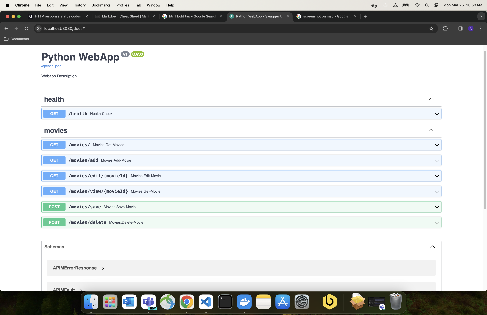
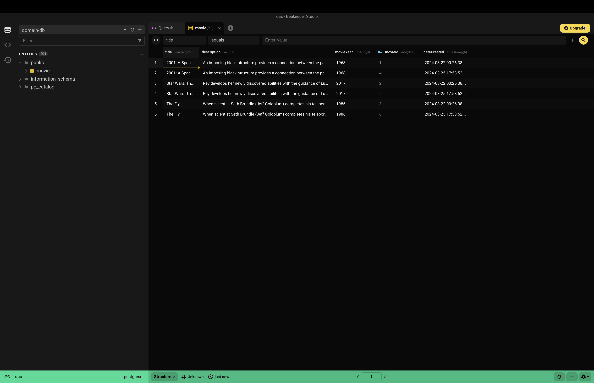
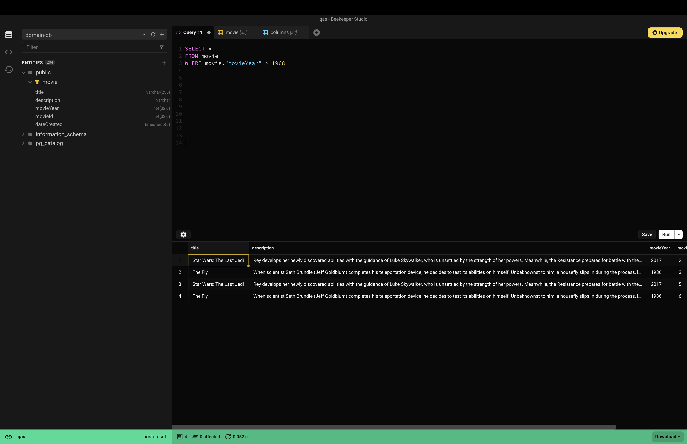

# ASPIRE
A.S.P.I.R.E. (Adaptive Scaffolding for Personalized Instruction and Responsive Education) aims to bridge the educational gap described in Bloom's 2 Sigma problem. Utilizing the results of fine-grain LLM-generated assessments, individualized interventions are constructed to guide students through the network of concepts on their path to mastery. These interventions can take many forms including personalized tutoring via an LLM aware of a student's educational path and areas of knowledge, as well as customized practice problems tuned to bridge any knowledge gaps that may impede progress through a course. This is achieved through the modeling of a course's domain via the concepts taught therein and their dependencies upon the knowledge of others, with this an educational path is established and the results of assessments are used to map the progress of students navigating these concepts while identifying and intervening before future points of friction and difficulty. 

# ASPIRE Team - Local Development (temporary)
We (ASPIRE Team) are temporarily developing locally, we will transition to a deployed development environment in the UCSD EKS infrastructure when resources are alloted to us. 
## Requirements
- Docker Desktop
## Recommended
- [Beekeeper Community Edition](https://github.com/beekeeper-studio/beekeeper-studio/releases/tag/v4.1.13) (SQL database visualization/interaction software)
## First Startup
- At the root level of the project create a new .env file
- Copy and paste the .env.template file contents to .env
- Open Docker Desktop
- Open terminal
- In the terminal, navigate to root directory of project
- Run chmod +x ./entrypoint.sh 
- Run 'docker volume create domain-db (volume for postgresql database to live)
- Run 'docker-compose build' (wait for completion)
- Run 'docker-compose up -d' (-d runs the logs detached, they can be found in the Docker Desktop UI. If you prefer logs to live in your terminal remove the '-d'.)
- Confirm two containers are built and running on Docker
- In a browser, navigate to http://localhost:8080/docs#, these are the autogenerated API docs, they should look something like the image below:

- If both containers are running and the Swagger docs can be accessed then you're good to go.
## Startup (n + 1):
- Open Docker Desktop
- Navigate to the project containers
- Click the 'play' button
- Confirm both containers have started and http://localhost:8080/docs# is accessible

Alternative start:
- Open Docker Desktop
- Open terminal
- In the terminal, navigate to the root directory of the project
- Run 'docker-compose up -d' 
- Confirm both containers have started and http://localhost:8080/docs# is accessible

## Local Development
- Where possible, confine all contributions to the ./app folder following the existing repository pattern described below in the README and in the movie app example code sprinkled throughout the repo.
- Some of the existing endpoints are protected by the UCSD Active Directory SSO system, these routes have the line `session = await get_user_info(request)` Comment this out if you'd like to test the endpoint. Could not retain required dependencies for this system while developing locally (SAML does not like installing locally). 
- Do not remove imports and code related to REDIS, SAML and SSO, comment out instead if conflicts arise, we will use this system when the application is deployed. 
- The 'deleteMe folder contains the proof of concept for an LLM Agent and contingency system, feel free to use and modify this when developing the final version of this.

### Connect to DB w/ Beekeeper (Optional)
- Download and install Beekeeper Community Edition  
- Open Beekeeper, select Postgres as your connection type
- fill in the form, should match the image below if using the same .env variables as the .env.template:

- The password can be found in your .env file assigned to the variable `POSTGRES_PASSWORD`
- Click the 'Test' button, if the connection passes be sure to save the connection before clicking 'Connect'. (docker must be open and the DB container running for this to work)
- From here, existing tables can be found under the "Public" folder on the left hand side, double clicking a table will display its contents:

- SQL queries can be made and tested here as well:

---
  
  

# Python API Archetype
# TODO
- Documentation
## Additional Features
- search movies
- logging
- jwt support
- testing

# Architecture
This template is structured roughly following a hexagonal (or ports and adapters) architecture, with protocols defining the ports and with implementations of the protocols and routes forming the adapters. Routes depend on the protocols and rely on dependency injection to provide the correct implementation. Data access is modeled by a repository pattern.

## Project Structure
- `app/api` is the REST API layer where routes are defined. Code here can depend on code in the domain and infrastructure folders, though ideally on abstractions.
    - the app.py file is where the API is initialized and acts as the entry point to the API
- `app/config` is where configuration lives
- `app/domain` is where the core business logic or "domain" is defined, as well as the definition of protocols. Code in this folder shouldn't directly depend on code in the api or infrastructure folders.
    - `/protocols` contains folders for each type of protocol (service, repository, etc) and inside are the protocols themselves
    - `/services` are the application services
    - `/models` represent the domain objects (e.g. Movies) and can contain business logic. They generally shouldn't have dependecies from other folders. In this example case, the models are light on business logic, though do include some validation. There is some mixing of database and domain models that in a more complex app could be separated.
- `app/infrastructure` contains all of the supporting code that the rest of the application relies upon. Implementations of ports lives here (e.g. specific implementations of the Movies repository, in this case a SQLite implementation)
# Development

In general, look for `# TODO` comments through the code to find places for custom development. Use the `movies.py` files as examples to replace with your required code.
## Routes
Each file in `app/api/routes` corresponds to a resource, with each file containing the individual methods available on each resource. The root route is reserved for special cases, such as the health check or an OAuth callback. Following the pattern, each route router should be registered in the `app/api/routes/__init__.py` file.

## Configuration
Config is handled via a Settings object. This `Settings` object is environment aware and will attempt to load values from environment variables. For local development, you can use python-dotenv and a `.env` file in the top-level folder to set values. Once deployed, the application can use the server environment variables or the `.env` file or both.

## Dependencies
Add new dependencies using `pip install`. Save the dependencies using `pip freeze > requirements.txt`. Make sure `requirements.txt` is version controlled.

# Deployment
Deployment occurs via a CI/CD pipeline in [Bamboo](build.ucsd.edu). The build step pulls dependencies and tests the code inside the target Docker container, and then packages the application into a Docker image published to Artifactory. The deployment step utilizes Helm and a Helm chart to deploy to EKS. Configuration of the Helm chart is available via the values.yaml file provided. The Helm chart has place to define environment variables and secrets, which can be filled in at deploy time from Bamboo.